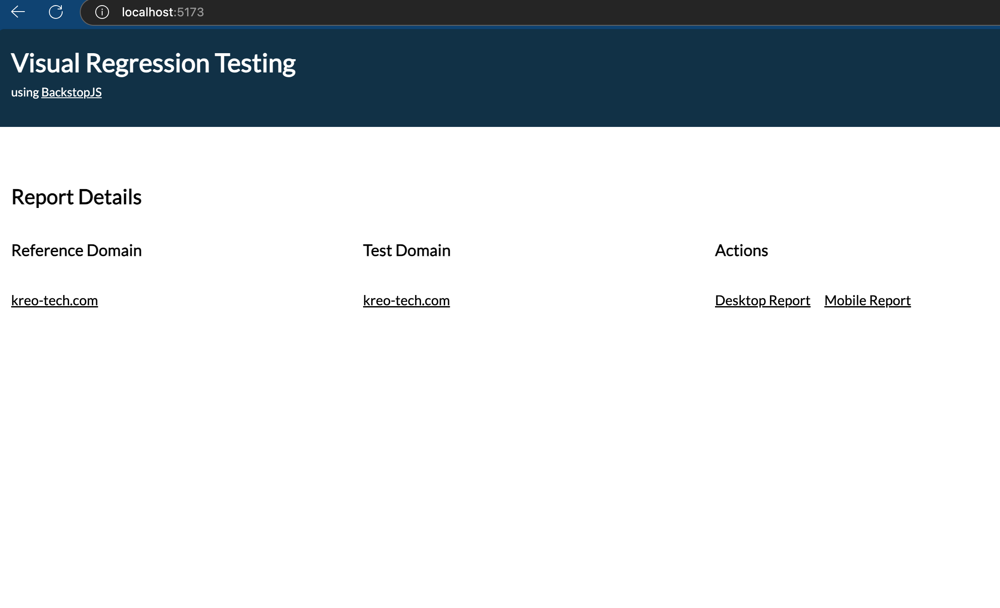
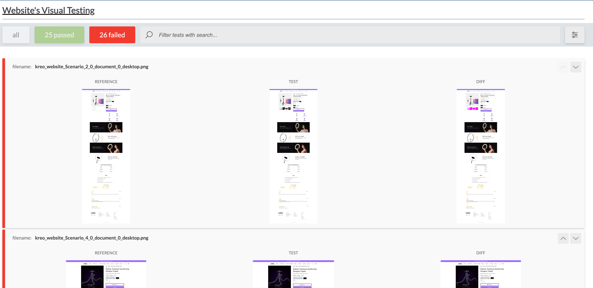
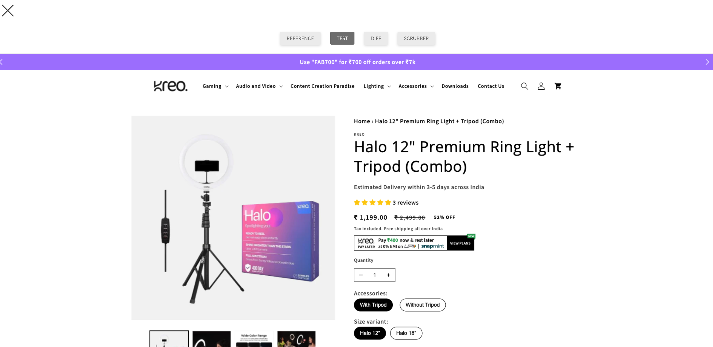
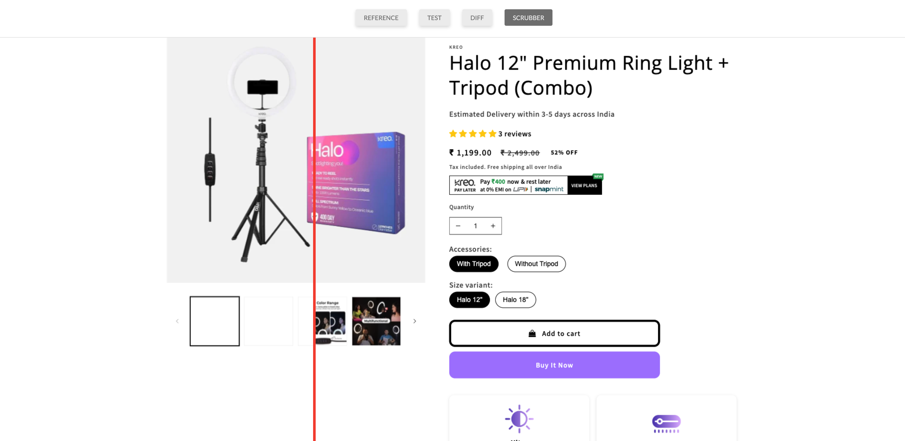

# Visual Regression Testing UI

A self-hosted visual regression testing tool built on top of BackstopJS, providing a modern UI interface to compare and analyze visual differences between reference and test websites. Perfect for catching visual regressions before deploying to production. The UI can be fully customized based on the report JSON.

For more configuration visit: https://github.com/garris/BackstopJS

## Features

- 🖼️ Side-by-side visual comparison
- 📱 Multi-viewport testing (desktop/mobile)
- 🔍 Image scrubber for detailed comparison
- 🔄 CI/CD integration with GitHub Actions
- 📊 Comprehensive test reports
- 🚀 Vercel deployment support
- 🎯 Filter tests by status (passed/failed)
- 🔎 Search functionality
- 📱 Responsive design

## Screenshots


*Dashboard showing test results overview*


*Visual comparison between reference and test screenshots*


*Overall test reslts*


*Side by side image comparison with scrubber*


## Tech Stack

- Vite + React for the frontend
- BackstopJS for visual regression testing
- Playwright for browser automation
- GitHub Actions for CI/CD
- Vercel for deployment

## Prerequisites

- Node.js (Latest LTS version)
- npm (comes with Node.js)
- Git

## Local Installation

1. Clone the repository:
```bash
git clone <repository-url>
cd backstopjs-visual-testing
```

2. Install dependencies:
```bash
npm install
```

3. Install Playwright browsers:
```bash
npx playwright install
```

4. Configure your websites in `website-config.js`:
```javascript
export const websites = [
  {
    name: "your_website",
    referenceDomain: "staging.example.com",
    domain: "production.example.com",
    sitemap: {
      endpoint: "/sitemap.xml",
      format: "xml"
    },
    defaultStorageState: {
      cookies: [
        {
          name: "auth_cookie",
          value: "your_cookie_value"
        }
      ]
    }
  }
];
```

## Generating Reports Locally

1. Generate BackstopJS configuration:
```bash
npm run backstop:generate
```

2. Create reference screenshots:
```bash
npm run backstop:reference
```

3. Run visual regression tests:
```bash
npm run backstop:test
```

4. Start the UI server:
```bash
npm run dev
```

5. View the results at `http://localhost:5173`

## GitHub Actions Integration

1. Add the following secrets to your GitHub repository:
   - `VERCEL_ORG_ID`
   - `VERCEL_PROJECT_ID`
   - `VERCEL_TOKEN`

More details on: https://vercel.com/guides/how-can-i-use-github-actions-with-vercel

2. The workflow will:
   - Generate configuration files
   - Create reference screenshots
   - Run visual regression tests
   - Deploy results to Vercel

## Project Structure

```
├── scripts/
│   ├── config-generator.js    # Generates BackstopJS configs
│   ├── test.js               # Runs visual regression tests
│   └── references.js         # Creates reference screenshots
├── public/
│   └── {website}/
│       ├── bitmaps_reference/ # Reference screenshots
│       ├── bitmaps_test/     # Test screenshots
│       └── report/           # HTML reports
├── reports/
│   └── {website}/
│       └── jsonReport.json   # Test results data
└── website-config.js         # Website configurations
```

## Best Practices

1. **Reference Images**
   - Keep reference images up-to-date
   - Document visual changes
   - Use version control for reference images

2. **Test Configuration**
   - Use meaningful test names
   - Set appropriate viewport sizes
   - Configure reasonable wait times for dynamic content

3. **CI/CD Integration**
   - Run tests on pull requests
   - Automate reference image updates
   - Store test artifacts

## Troubleshooting

- **Missing Reports**: Ensure the `reports` directory exists and BackstopJS tests completed successfully
- **Test Failures**: Check network connectivity and cookie configurations
- **Configuration Issues**: Validate JSON syntax and domain accessibility

## Contributing

Contributions are welcome! Please feel free to submit a Pull Request.

## License

MIT License
